# OpenTelemetry Java Log4j Appender 統合の詳細解説

## 概要

この資料は、OpenTelemetry Java SDK と Log4j Appender の統合について、**Java内のインスタンス関係性とデータフロー**を中心に詳しく説明します。

Log4j Appender を使用することで、既存のLog4jコードを変更せずに、OpenTelemetryのテレメトリー機能を追加できます。

---

## 1. アーキテクチャ概要

### 1.1 コンポーネント構成

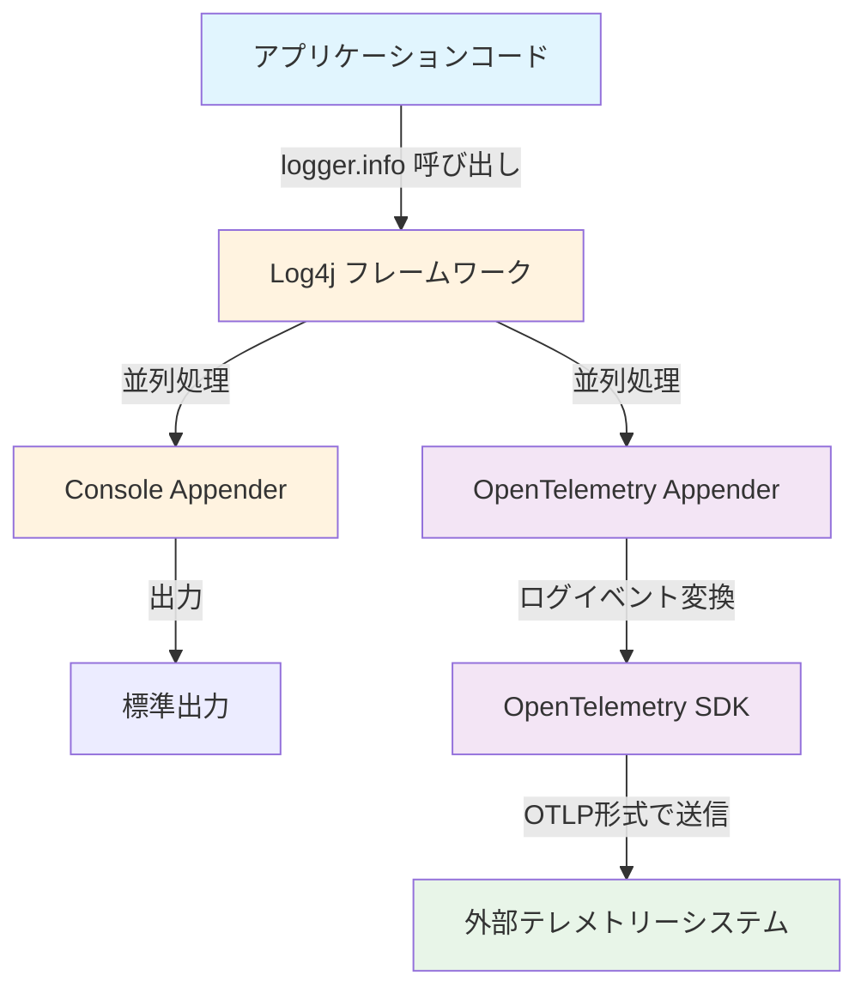

### 1.2 主要インスタンスの関係性

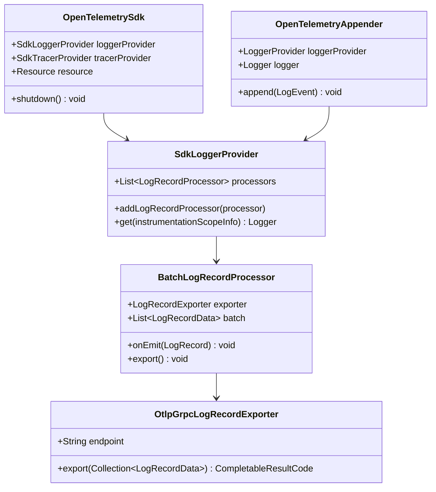

OpenTelemetry と Log4j の統合では、以下のJavaインスタンスが重要な役割を果たします：

| インスタンス | 役割 | ライフサイクル |
|-------------|------|-------------|
| `OpenTelemetrySdk` | 全体の統括管理 | アプリケーション起動時に作成、終了時にクローズ |
| `SdkLoggerProvider` | ログ処理の管理 | SDKの一部として作成、ログ機能を提供 |
| `OpenTelemetryAppender` | Log4j統合 | Log4j設定で作成、ログイベントを変換 |
| `BatchLogRecordProcessor` | バッチ処理 | プロバイダー内で作成、効率的な送信を担当 |
| `OtlpGrpcLogRecordExporter` | 外部送信 | プロセッサー内で作成、実際の送信を実行 |

---

## 2. 詳細なデータフロー解析

### 2.1 ログメッセージの処理フロー

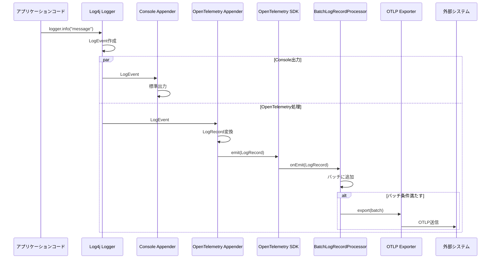

#### ステップ1: ログメッセージの生成
```java
// アプリケーションコードでの通常のLog4j使用
logger.info("ユーザーログイン: name={}, id={}", userName, userId);
```

**内部処理**:
1. `Logger` インスタンスが `LogEvent` オブジェクトを作成
2. `LogEvent` にはメッセージ、レベル、タイムスタンプ、スレッド情報が含まれる
3. Log4j内部で設定されたAppenderリストに処理が渡される

#### ステップ2: OpenTelemetry Appender での変換処理
```java
// OpenTelemetryAppender.append() メソッド内での処理
public void append(LogEvent event) {
    // Log4jのLogEventをOpenTelemetryのLogRecordBuilderに変換
    LogRecordBuilder builder = loggerProvider
        .loggerBuilder("log4j-appender")
        .build()
        .logRecordBuilder();
        
    // ログレベルの変換（Log4j → OpenTelemetry）
    builder.setSeverity(convertSeverity(event.getLevel()));
    
    // メッセージ本文の設定
    builder.setBody(event.getMessage().getFormattedMessage());
    
    // タイムスタンプの設定
    builder.setTimestamp(event.getInstant());
    
    // 属性の抽出と設定
    extractAttributes(event, builder);
    
    // LogRecordとして送信
    builder.emit();
}
```

#### ステップ3: BatchLogRecordProcessor での集約
```java
// バッチ処理での効率化
class BatchLogRecordProcessor {
    private final List<LogRecordData> batch = new ArrayList<>();
    
    @Override
    public void emit(LogRecordBuilder logRecord) {
        batch.add(logRecord.build());
        
        // バッチサイズに達したら、または一定時間経過で送信
        if (batch.size() >= maxBatchSize || 
            timeSinceLastExport > scheduleDelay) {
            exportBatch();
        }
    }
}
```

#### ステップ4: OTLP Exporter での外部送信
```java
// 実際の送信処理
class OtlpGrpcLogRecordExporter {
    @Override
    public CompletableResultCode export(Collection<LogRecordData> logs) {
        // ログレコードをOTLP（protobuf）形式に変換
        ExportLogsServiceRequest request = convertToOtlp(logs);
        
        // gRPC経由で送信
        return sendViaGrpc(request);
    }
}
```

### 2.2 トレースコンテキストとの連携

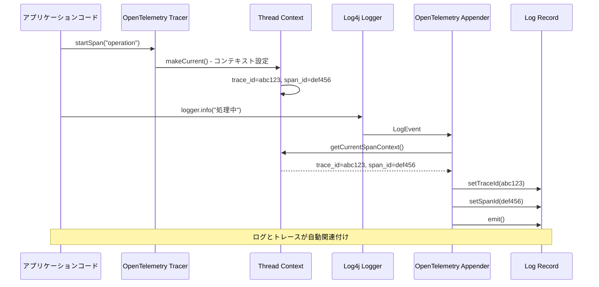

#### トレースコンテキスト情報の自動付与
```java
// スパンがアクティブな時のログ出力
try (Scope scope = span.makeCurrent()) {
    logger.info("処理中のログ");  // ← このログに自動でtrace_id, span_idが付与される
}
```

**内部メカニズム**:
1. `Span.makeCurrent()` により、現在のスレッドにスパンコンテキストが設定される
2. `OpenTelemetryAppender` がログイベントを処理する際、現在のコンテキストを確認
3. アクティブなスパンが存在する場合、そのtrace_id, span_idをログレコードに自動付与
4. 結果として、ログとトレースが関連付けられる

---

## 3. 重要なJavaインスタンス間の関係性

### 3.1 OpenTelemetry初期化シーケンス

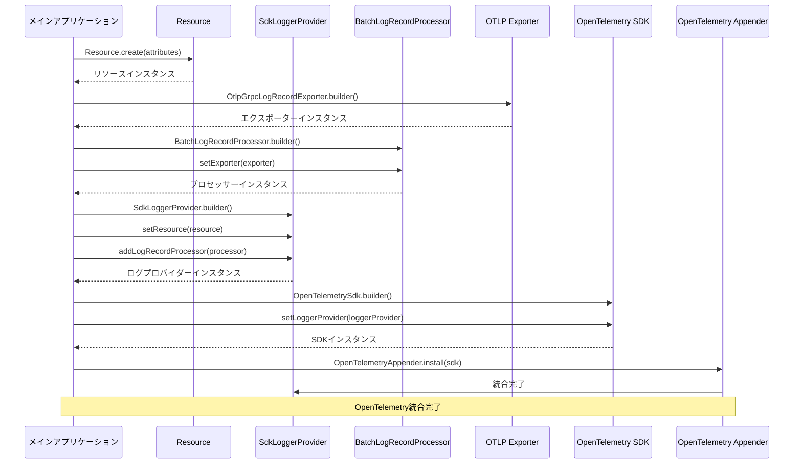

### 3.2 OpenTelemetrySdk（統括管理者）

```java
// インスタンス作成時の内部構造
OpenTelemetrySdk sdk = OpenTelemetrySdk.builder()
    .setLoggerProvider(loggerProvider)    // ログ機能の委譲
    .setTracerProvider(tracerProvider)    // トレース機能の委譲
    .buildAndRegisterGlobal();            // グローバル参照の登録
```

**役割**:
- 各プロバイダー（Logger, Tracer, Meter）の統合管理
- グローバルアクセスポイントの提供
- ライフサイクル管理（初期化、シャットダウン）

**インスタンス関係**:
- `SdkLoggerProvider` への参照を保持
- `SdkTracerProvider` への参照を保持
- 各プロバイダーの `close()` 処理を統括

### 3.2 SdkLoggerProvider（ログ処理エンジン）

```java
// プロバイダー作成時の内部構造
SdkLoggerProvider loggerProvider = SdkLoggerProvider.builder()
    .setResource(resource)               // リソース情報の関連付け
    .addLogRecordProcessor(processor)    // プロセッサーチェーンに追加
    .build();
```

**インスタンス構造**:
```java
class SdkLoggerProvider {
    private final Resource resource;                          // リソース情報
    private final List<LogRecordProcessor> processors;       // プロセッサーチェーン
    private final Clock clock;                               // タイムスタンプ管理
    private final CompletableResultCode shutdownResult;     // シャットダウン状態
}
```

**データフロー**:
1. `Logger.logRecordBuilder()` 呼び出し受信
2. `Resource` 情報を `LogRecordBuilder` に設定
3. 登録されたすべての `LogRecordProcessor` に処理を委譲

### 3.3 OpenTelemetryAppender（Log4j統合ブリッジ）

```java
// Appender の内部構造
class OpenTelemetryAppender extends AbstractAppender {
    private final Logger otelLogger;           // OpenTelemetry Logger インスタンス
    private final boolean captureAttributes;  // 属性キャプチャ設定
    private final AttributeExtractor extractor; // 属性抽出ロジック
}
```

**変換処理の詳細**:
```java
@Override
public void append(LogEvent event) {
    // 1. Log4j LogEvent から情報抽出
    String message = event.getMessage().getFormattedMessage();
    Level log4jLevel = event.getLevel();
    Instant timestamp = event.getInstant();
    
    // 2. OpenTelemetry LogRecord 形式に変換
    LogRecordBuilder builder = otelLogger.logRecordBuilder();
    builder.setBody(message);
    builder.setSeverity(mapSeverity(log4jLevel));
    builder.setTimestamp(timestamp);
    
    // 3. 属性の抽出と設定
    if (captureCodeAttributes) {
        builder.setAttribute("code.function", event.getSource().getMethodName());
        builder.setAttribute("code.namespace", event.getSource().getClassName());
        builder.setAttribute("code.lineno", event.getSource().getLineNumber());
    }
    
    // 4. トレースコンテキストの自動付与
    SpanContext spanContext = Span.current().getSpanContext();
    if (spanContext.isValid()) {
        builder.setAttribute("trace_id", spanContext.getTraceId());
        builder.setAttribute("span_id", spanContext.getSpanId());
    }
    
    // 5. ログレコードとして送信
    builder.emit();
}
```

### 3.4 BatchLogRecordProcessor（効率的バッチ処理）

#### バッチ処理フロー図

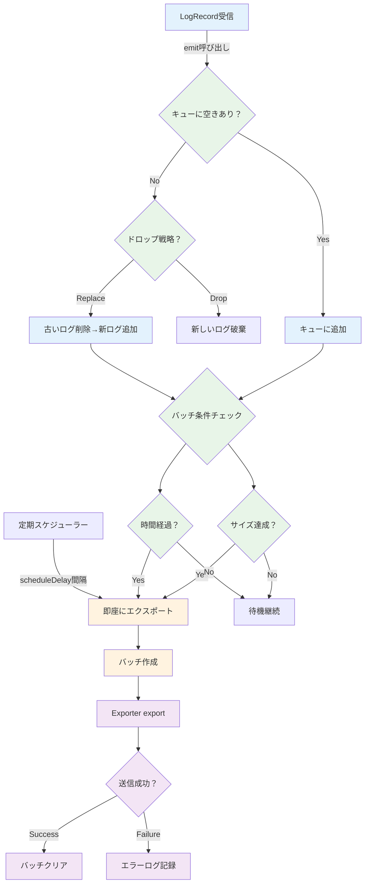

```java
// プロセッサーの内部状態
class BatchLogRecordProcessor {
    private final BlockingQueue<LogRecordData> queue;     // ログレコードキュー
    private final LogRecordExporter exporter;            // 実際の送信担当
    private final ScheduledExecutorService scheduler;    // 定期送信スケジューラー
    
    // バッチング設定
    private final int maxBatchSize;          // 最大バッチサイズ
    private final Duration scheduleDelay;    // 送信間隔
    private final Duration exportTimeout;   // 送信タイムアウト
}
```

#### バッチ処理の内部状態遷移

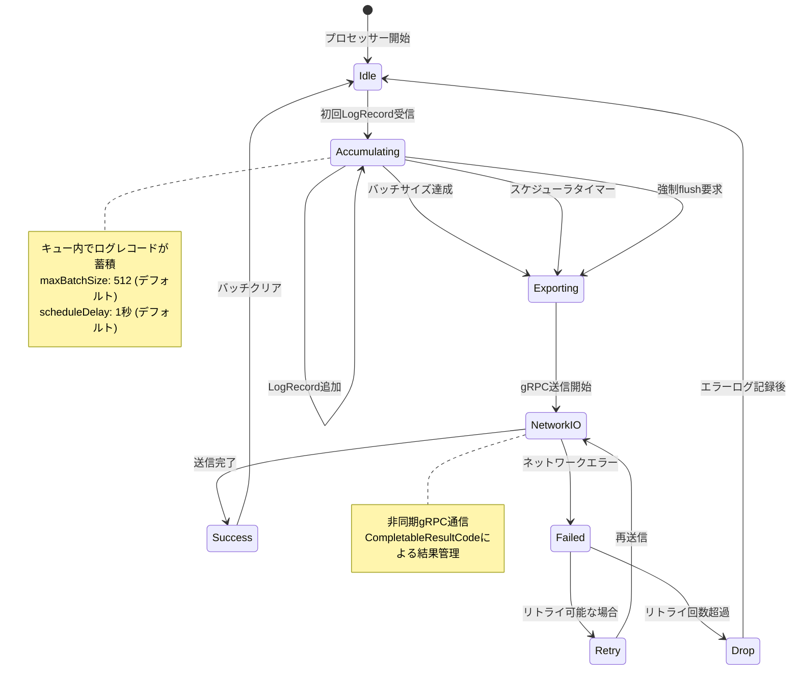

**バッチ処理ロジック**:
```java
// ログレコード受信時の処理
public void emit(LogRecordBuilder logRecord) {
    LogRecordData data = logRecord.build();
    
    // 非同期でキューに追加
    if (!queue.offer(data)) {
        // キューが満杯の場合の処理
        handleQueueFull(data);
    }
    
    // 条件チェックで即座送信判定
    checkForImmediateExport();
}

// 定期的なバッチ送信
private void exportBatch() {
    List<LogRecordData> batch = new ArrayList<>();
    
    // キューからバッチサイズ分取得
    queue.drainTo(batch, maxBatchSize);
    
    if (!batch.isEmpty()) {
        // エクスポーターに送信委譲
        CompletableResultCode result = exporter.export(batch);
        
        // 送信結果の処理
        result.whenComplete(() -> handleExportComplete(batch.size()));
    }
}
```

### 3.5 OtlpGrpcLogRecordExporter（OTLP送信）

#### OTLP エクスポートプロセス

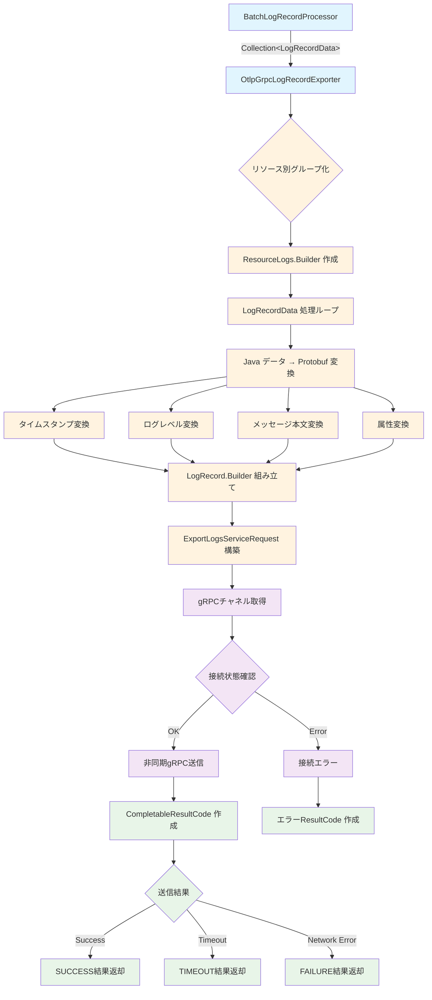

#### OTLP データ変換の詳細

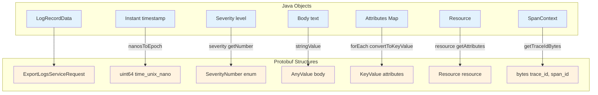

```java
// エクスポーターの内部構造
class OtlpGrpcLogRecordExporter {
    private final String endpoint;              // 送信先エンドポイント
    private final Duration timeout;            // 通信タイムアウト
    private final Metadata headers;            // gRPCヘッダー
    private final ManagedChannel channel;      // gRPC通信チャネル
    
    // Protobufマーシャラー（バイナリシリアライゼーション）
    private final Marshaller<ExportLogsServiceRequest> requestMarshaller;
}
```

#### gRPC 通信フロー

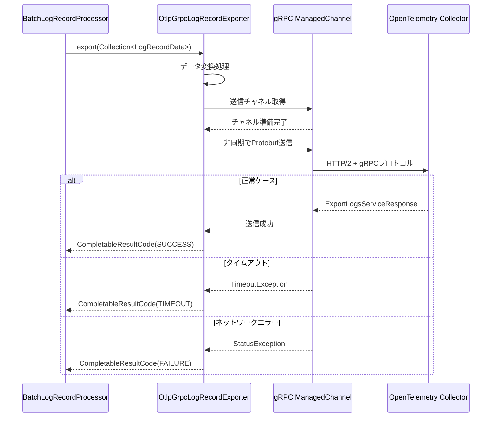

**OTLP変換処理**:
```java
public CompletableResultCode export(Collection<LogRecordData> logs) {
    // 1. LogRecordData を OTLP Protobuf 形式に変換
    ExportLogsServiceRequest.Builder requestBuilder = 
        ExportLogsServiceRequest.newBuilder();
    
    for (LogRecordData log : logs) {
        LogRecord.Builder logBuilder = LogRecord.newBuilder();
        
        // タイムスタンプ変換（Java Instant → Protobuf Timestamp）
        logBuilder.setTimeUnixNano(log.getTimestampEpochNanos());
        
        // ログレベル変換
        logBuilder.setSeverityNumber(log.getSeverity().getSeverityNumber());
        logBuilder.setSeverityText(log.getSeverity().getText());
        
        // メッセージ本文
        logBuilder.setBody(AnyValue.newBuilder()
            .setStringValue(log.getBody().asString())
            .build());
        
        // 属性変換（Java Map → Protobuf KeyValue）
        log.getAttributes().forEach((key, value) -> {
            logBuilder.addAttributes(KeyValue.newBuilder()
                .setKey(key.getKey())
                .setValue(convertToAnyValue(value))
                .build());
        });
        
        requestBuilder.addLogRecords(logBuilder);
    }
    
    // 2. gRPC経由で非同期送信
    return sendAsyncViaGrpc(requestBuilder.build());
}
```

---

## 4. インスタンスライフサイクル管理

### 4.1 初期化フロー

```java
// 初期化時のインスタンス作成順序と依存関係
public static OpenTelemetrySdk initializeOpenTelemetry() {
    // 1. Resource作成（依存関係なし）
    Resource resource = Resource.builder()
        .put(ServiceAttributes.SERVICE_NAME, "example-service")
        .build();
    
    // 2. Exporter作成（Resourceに依存）
    OtlpGrpcLogRecordExporter exporter = OtlpGrpcLogRecordExporter.builder()
        .setEndpoint("http://localhost:4317")
        .build();
    
    // 3. Processor作成（Exporterに依存）
    BatchLogRecordProcessor processor = BatchLogRecordProcessor.builder(exporter)
        .build();
    
    // 4. Provider作成（ResourceとProcessorに依存）
    SdkLoggerProvider loggerProvider = SdkLoggerProvider.builder()
        .setResource(resource)
        .addLogRecordProcessor(processor)
        .build();
    
    // 5. SDK作成（Providerに依存）
    OpenTelemetrySdk sdk = OpenTelemetrySdk.builder()
        .setLoggerProvider(loggerProvider)
        .build();
    
    // 6. Log4j統合の最後設定（SDKに依存）
    OpenTelemetryAppender.install(sdk);
    
    return sdk;
}
```

### 4.2 実行時のインスタンス相互作用

#### ログ出力時の内部呼び出しチェーン

```java
// 1. アプリケーションコード
logger.info("メッセージ");
        ↓
// 2. Log4j Core
LoggerConfig.callAppenders(LogEvent)
        ↓
// 3. OpenTelemetry Appender
OpenTelemetryAppender.append(LogEvent)
        ↓ LogEvent → LogRecordBuilder 変換
// 4. SdkLoggerProvider
SdkLogger.emit(LogRecordBuilder)
        ↓ LogRecordBuilder → LogRecordData 変換
// 5. BatchLogRecordProcessor  
BatchLogRecordProcessor.emit(LogRecordData)
        ↓ キューイング、バッチング
// 6. OtlpGrpcLogRecordExporter
OtlpGrpcLogRecordExporter.export(Collection<LogRecordData>)
        ↓ OTLP Protobuf変換、gRPC送信
// 7. 外部システム（OpenTelemetry Collector など）
```

### 4.3 スレッドセーフティとパフォーマンス

#### 同期・非同期処理の区分

| 処理段階 | 同期/非同期 | 理由 |
|---------|-----------|------|
| `logger.info()` 呼び出し | 同期 | アプリケーションスレッドで実行 |
| `OpenTelemetryAppender.append()` | 同期 | ログイベント変換は軽量処理 |
| `BatchLogRecordProcessor.emit()` | 同期 | キューへの追加は高速 |
| `OtlpGrpcLogRecordExporter.export()` | **非同期** | ネットワーク送信は別スレッド |

#### スレッド管理の詳細

```java
// BatchLogRecordProcessor での内部スレッド管理
class BatchLogRecordProcessor {
    // 専用ワーカースレッドでの送信処理
    private final ScheduledExecutorService scheduledExecutorService;
    
    private void startExportWorker() {
        scheduledExecutorService.scheduleAtFixedRate(() -> {
            try {
                exportCurrentBatch();  // 定期的なバッチ送信
            } catch (Exception e) {
                logger.warn("バッチエクスポートでエラーが発生", e);
            }
        }, scheduleDelay.toMillis(), scheduleDelay.toMillis(), TimeUnit.MILLISECONDS);
    }
}
```

### 4.5 リソースコンテキストの付与メカニズム

リソースコンテキストは、**どのサービスからテレメトリーデータが送信されたか**を識別する重要な情報です。OpenTelemetry Java Log4j Appender では、この情報が以下のフローで自動的に付与されます。

#### リソース属性付与の全体フロー

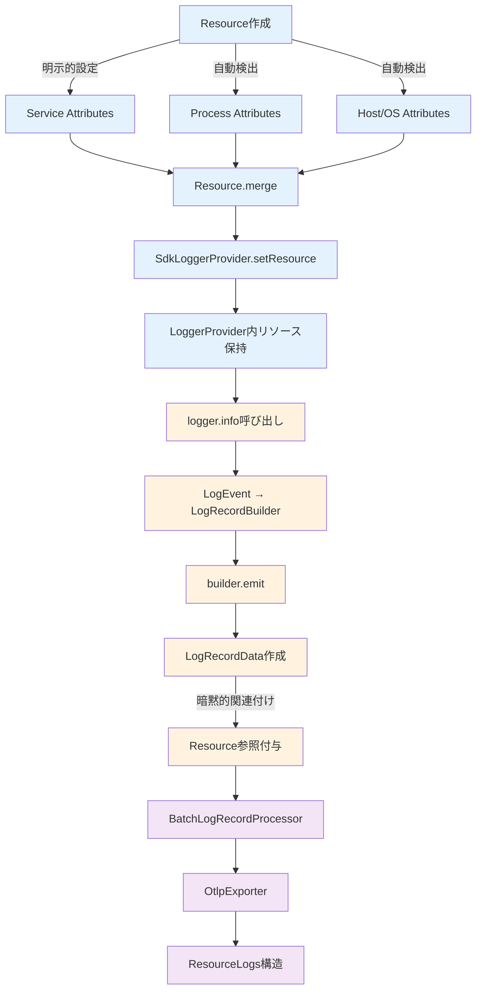

#### リソース情報の設定場所

```java
// 1. Resource オブジェクトの作成（初期化時）
Resource resource = Resource.getDefault()
    .merge(Resource.builder()
        .put(ServiceAttributes.SERVICE_NAME, "otel-log4j-example")      
        .put(ServiceAttributes.SERVICE_VERSION, "1.0.0")               
        .put(ServiceAttributes.SERVICE_NAMESPACE, "example.com")       
        .build());

// 2. SdkLoggerProvider へのリソース関連付け
SdkLoggerProvider loggerProvider = SdkLoggerProvider.builder()
    .setResource(resource)          // ← ここでリソースを関連付け
    .addLogRecordProcessor(processor)
    .build();
```

**重要なポイント**: リソース情報は `SdkLoggerProvider.builder().setResource(resource)` で設定され、そのプロバイダーから作成される**すべてのLogRecord**に自動的に関連付けられます。

#### 自動付与されるリソース属性の詳細

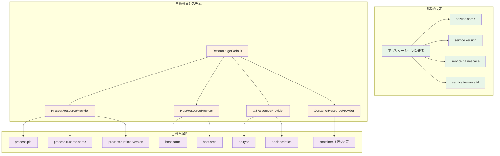

OpenTelemetry Java SDK は、明示的に設定した属性に加えて、以下の情報を**自動的**に検出・付与します：

```java
// Resource.getDefault() で自動検出される属性例
Resource defaultResource = Resource.getDefault();
// 実際に含まれる属性:
// - "process.pid": プロセスID
// - "process.runtime.name": "OpenJDK Runtime Environment"  
// - "process.runtime.version": "17.0.2+8"
// - "process.runtime.description": JVM詳細情報
// - "os.type": "linux" / "windows" / "darwin"
// - "os.description": OS詳細情報
// - "host.name": ホスト名
// - "host.arch": "amd64" / "arm64" 等
```

#### リソースコンテキスト付与のタイミング

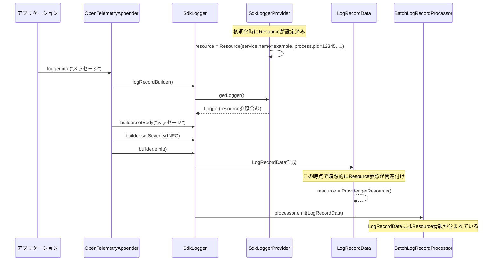

```java
// LogRecord 作成時のリソース関連付けフロー

// 1. Log4j Appender でのログイベント受信
@Override
public void append(LogEvent event) {
    // 2. SdkLogger から LogRecordBuilder 取得
    LogRecordBuilder builder = sdkLogger.logRecordBuilder();
    
    // 3. ログ固有の属性を設定
    builder.setBody(event.getMessage().getFormattedMessage());
    builder.setSeverity(mapSeverity(event.getLevel()));
    // ... その他の属性
    
    // 4. LogRecord として emit
    builder.emit();  // ← この時点でリソース情報が暗黙的に関連付けされる
}

// SdkLogger.emit() の内部処理
class SdkLogger {
    private final Resource resource;  // プロバイダーから受け継いだリソース
    
    void emit(LogRecordBuilder builder) {
        // LogRecordBuilder から LogRecordData を作成
        LogRecordData logRecord = builder.build();
        
        // この時点で logRecord は以下を持つ：
        // - ログ固有の属性（メッセージ、レベル、タイムスタンプ等）
        // - 暗黙的なリソース参照（service.name, service.version等）
        
        // プロセッサーチェーンに渡す
        processors.forEach(processor -> processor.emit(logRecord));
    }
}
```

#### エクスポート時のリソース情報処理

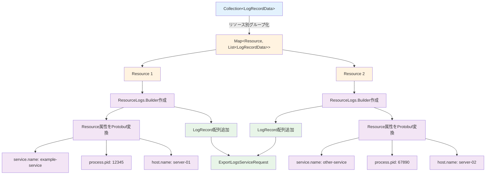

```java
// OtlpGrpcLogRecordExporter でのリソース処理
public CompletableResultCode export(Collection<LogRecordData> logs) {
    ExportLogsServiceRequest.Builder requestBuilder = 
        ExportLogsServiceRequest.newBuilder();
    
    // リソース情報の抽出と設定
    Map<Resource, List<LogRecordData>> groupedByResource = 
        logs.stream().collect(Collectors.groupingBy(LogRecordData::getResource));
    
    groupedByResource.forEach((resource, resourceLogs) -> {
        ResourceLogs.Builder resourceLogsBuilder = ResourceLogs.newBuilder();
        
        // 1. リソース属性をOTLP形式に変換
        io.opentelemetry.proto.resource.v1.Resource.Builder resourceBuilder = 
            io.opentelemetry.proto.resource.v1.Resource.newBuilder();
            
        resource.getAttributes().forEach((attributeKey, attributeValue) -> {
            resourceBuilder.addAttributes(KeyValue.newBuilder()
                .setKey(attributeKey.getKey())
                .setValue(convertToAnyValue(attributeValue))
                .build());
        });
        
        resourceLogsBuilder.setResource(resourceBuilder.build());
        
        // 2. ログレコード本体を設定
        resourceLogs.forEach(logRecord -> {
            LogRecord.Builder logBuilder = LogRecord.newBuilder();
            
            // ログ固有の属性を設定
            logBuilder.setTimeUnixNano(logRecord.getTimestampEpochNanos());
            logBuilder.setSeverityNumber(logRecord.getSeverity().getSeverityNumber());
            logBuilder.setBody(AnyValue.newBuilder()
                .setStringValue(logRecord.getBody().asString())
                .build());
                
            // ログレコード固有の属性を追加
            logRecord.getAttributes().forEach((key, value) -> {
                logBuilder.addAttributes(KeyValue.newBuilder()
                    .setKey(key.getKey())
                    .setValue(convertToAnyValue(value))
                    .build());
            });
            
            resourceLogsBuilder.addLogRecords(logBuilder.build());
        });
        
        requestBuilder.addResourceLogs(resourceLogsBuilder.build());
    });
    
    return sendViaGrpc(requestBuilder.build());
}
```

**結論**: リソース情報とログ属性は**分離されて管理**されており、エクスポート時に適切な形式で結合されます。

#### 実際の OTLP 出力構造

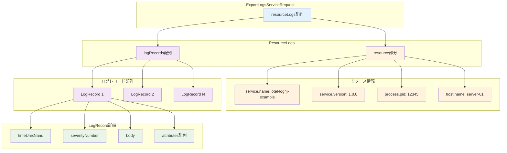

```json
{
  "resourceLogs": [
    {
      "resource": {
        "attributes": [
          {"key": "service.name", "value": {"stringValue": "otel-log4j-example"}},
          {"key": "service.version", "value": {"stringValue": "1.0.0"}},
          {"key": "process.pid", "value": {"intValue": 12345}},
          {"key": "process.runtime.name", "value": {"stringValue": "OpenJDK Runtime Environment"}}
        ]
      },
      "logRecords": [
        {
          "timeUnixNano": "1640995200000000000",
          "severityNumber": 9,
          "severityText": "INFO", 
          "body": {"stringValue": "ユーザーログイン: name=田中太郎, id=12345"},
          "attributes": [
            {"key": "log.logger.name", "value": {"stringValue": "com.example.otel.LoggingExample"}},
            {"key": "thread.name", "value": {"stringValue": "main"}},
            {"key": "trace_id", "value": {"stringValue": "abc123..."}},
            {"key": "span_id", "value": {"stringValue": "def456..."}}
          ]
        }
      ]
    }
  ]
}
```

この構造により、**リソース情報**（サービス識別）と**ログ固有の属性**が適切に分離されつつ、関連付けられてエクスポートされます。

---

## 5. 属性とコンテキスト情報の詳細

### 5.1 自動抽出される属性情報

OpenTelemetry Appender は Log4j のログイベントから以下の情報を自動抽出します：

#### 基本ログ属性
```java
// 常に抽出される基本情報
LogRecordBuilder builder = logger.logRecordBuilder()
    .setSeverity(mapLogLevel(event.getLevel()))           // ログレベル
    .setBody(event.getMessage().getFormattedMessage())    // メッセージ本文  
    .setTimestamp(event.getInstant())                     // タイムスタンプ
    .setAttribute("log.logger.name", event.getLoggerName()) // ロガー名
    .setAttribute("log.logger.level", event.getLevel().toString()); // レベル文字列
```

#### 設定可能な拡張属性
```xml
<!-- log4j2.xml での設定に応じて抽出される属性 -->
<OpenTelemetry name="OpenTelemetryAppender"
              captureExperimentalAttributes="true"    <!-- スレッド情報 -->
              captureCodeAttributes="true"            <!-- ソースコード情報 -->
              captureMapMessageAttributes="true"      <!-- Map形式メッセージ -->
              captureMarkerAttribute="true"           <!-- Log4j Marker -->
              captureContextDataAttributes="*" />     <!-- ThreadContext情報 -->
```

対応する Java での属性抽出：
```java
// captureCodeAttributes="true" の場合
if (captureCodeAttributes) {
    StackTraceElement source = event.getSource();
    builder.setAttribute("code.namespace", source.getClassName());
    builder.setAttribute("code.function", source.getMethodName());  
    builder.setAttribute("code.lineno", source.getLineNumber());
    builder.setAttribute("code.filepath", source.getFileName());
}

// captureExperimentalAttributes="true" の場合  
if (captureExperimentalAttributes) {
    builder.setAttribute("thread.name", event.getThreadName());
    builder.setAttribute("thread.id", event.getThreadId());
}

// captureContextDataAttributes="*" の場合
event.getContextData().forEach((key, value) -> {
    builder.setAttribute("log4j.context_data." + key, value.toString());
});
```

### 5.2 MapMessage での構造化ログ

```java
// アプリケーションコードでの MapMessage 使用
Map<String, Object> logData = new HashMap<>();
logData.put("user_id", "12345");
logData.put("action", "file_upload");  
logData.put("file_size", 1048576);

MapMessage mapMessage = new MapMessage(logData);
logger.info(mapMessage);
```

**内部変換処理**:
```java
// OpenTelemetryAppender での MapMessage 処理
if (event.getMessage() instanceof MapMessage && captureMapMessageAttributes) {
    MapMessage mapMessage = (MapMessage) event.getMessage();
    
    // Map の各エントリを OpenTelemetry 属性に変換
    mapMessage.getData().forEach((key, value) -> {
        // プレフィックスを付けて名前空間を明確化
        String attributeKey = "log4j.map_message." + key;
        builder.setAttribute(attributeKey, convertToAttributeValue(value));
    });
}
```

---

## 6. エラーハンドリングと障害対応

### 6.1 エラーハンドリングフロー

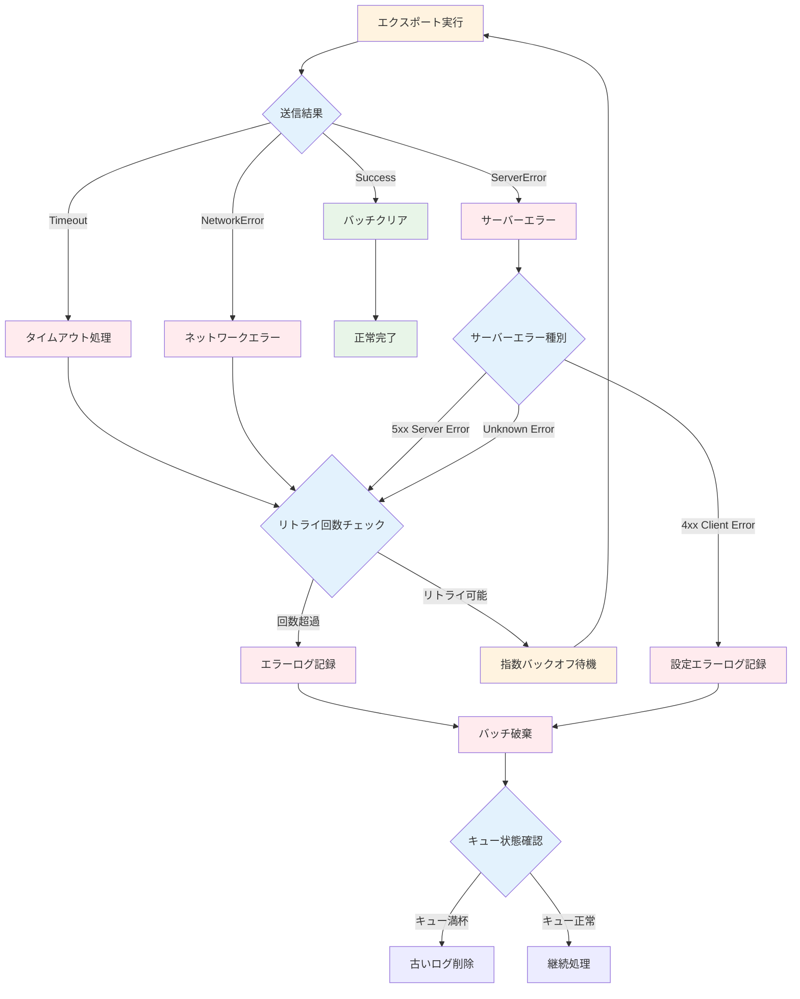

#### リトライ戦略の詳細

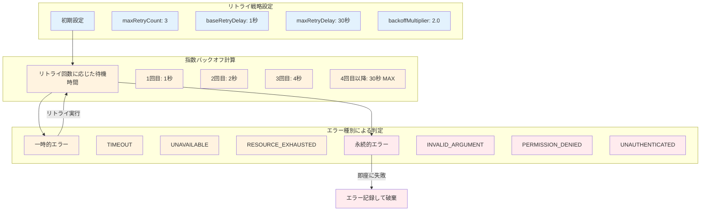

### 6.1 エクスポート失敗時の処理

```java
// BatchLogRecordProcessor でのエラーハンドリング
private void exportCurrentBatch() {
    List<LogRecordData> currentBatch = getCurrentBatch();
    
    CompletableResultCode exportResult = exporter.export(currentBatch);
    
    exportResult.whenComplete(() -> {
        if (exportResult.isSuccess()) {
            // 成功時: 送信済みデータをクリア
            clearExportedData(currentBatch);
        } else {
            // 失敗時: ログを記録し、設定に応じてリトライまたは破棄
            logger.warn("ログエクスポートに失敗: batch_size={}", currentBatch.size());
            
            // デフォルトではバッファがフルの場合、古いログから破棄される
            handleExportFailure(currentBatch);
        }
    });
}
```

### 6.2 メモリ管理と背圧制御

```java
// キュー満杯時の背圧制御
class BatchLogRecordProcessor {
    private final BlockingQueue<LogRecordData> queue;
    private final int maxQueueSize;
    
    public void emit(LogRecordBuilder logRecord) {
        LogRecordData data = logRecord.build();
        
        // ノンブロッキングでキューに追加試行
        if (!queue.offer(data)) {
            // キューが満杯の場合
            if (dropOnQueueFull) {
                // ドロップ戦略: 新しいログを破棄
                metricsCollector.incrementDroppedLogs();
            } else {
                // 置換戦略: 古いログを削除して新しいログを追加
                queue.poll(); // 最古のログを削除
                queue.offer(data); // 新しいログを追加
            }
        }
    }
}
```

---

## 7. パフォーマンスと最適化

### 7.1 リソース使用量とパフォーマンス特性

#### メモリ使用量の内訳

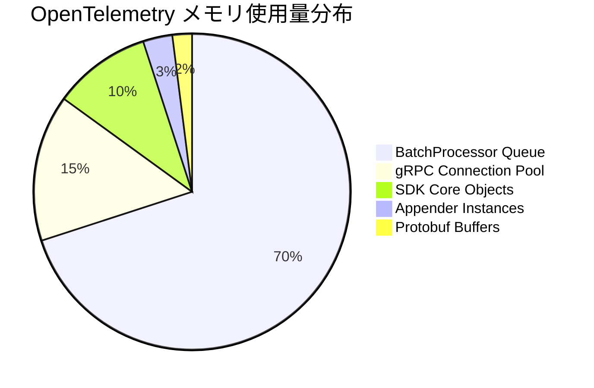

#### CPU使用量の分析

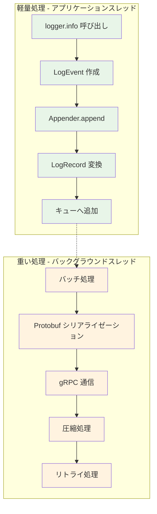

### 7.1 メモリフットプリント

**主要コンポーネントのメモリ使用量**:

```java
// 典型的なメモリ使用量（概算）
OpenTelemetrySdk sdk:                    ~100KB（設定オブジェクト）
BatchLogRecordProcessor queue:           ~数MB（キューサイズに依存）
OtlpGrpcLogRecordExporter:              ~500KB（gRPC接続プール）
OpenTelemetryAppender instances:         ~10KB/appender
```

#### メモリ効率化戦略

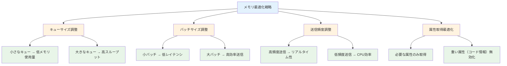

**メモリ効率化設定**:
```java
// 低メモリ環境向けの設定例
BatchLogRecordProcessor processor = BatchLogRecordProcessor.builder(exporter)
    .setMaxExportBatchSize(100)                       // バッチサイズを小さく
    .setMaxQueueSize(1000)                           // キューサイズを制限
    .setScheduleDelay(Duration.ofSeconds(1))         // 送信頻度を上げる
    .build();
```

### 7.2 CPU使用量の最適化

**処理負荷の分散**:
```java
// アプリケーションスレッドでの処理（軽量）
logger.info("メッセージ");  // ← ここは数マイクロ秒で完了

// バックグラウンドスレッドでの処理（重い処理）
- ログレコードのシリアライゼーション（protobuf変換）
- ネットワーク送信
- バッチ処理
```

**最適化のベストプラクティス**:
1. **バッチサイズの調整**: 大きすぎるとメモリ使用量増、小さすぎると送信頻度増
2. **送信間隔の調整**: 短いとCPU使用量増、長いとメモリ使用量増
3. **属性取得の選択**: 不要な属性の無効化でオーバーヘッド削減

---

## 8. トラブルシューティング

### 8.1 問題診断フローチャート

```mermaid
flowchart TD
    A[ログが送信されない問題] --> B{デバッグログ有効？}
    B -->|No| C[デバッグログを有効化]
    B -->|Yes| D{OpenTelemetryAppender.install実行済み？}
    
    C --> D
    D -->|No| E[mainでinstall実行]
    D -->|Yes| F{log4j2.xmlにAppenderRef設定？}
    
    E --> G[問題解決]
    F -->|No| H[AppenderRef追加]
    F -->|Yes| I{SDK正常初期化？}
    
    H --> G
    I -->|No| J[初期化エラー確認]
    I -->|Yes| K{エクスポーター設定正常？}
    
    J --> L[Resource/Exporter設定見直し]
    K -->|No| M[エンドポイントURL確認]
    K -->|Yes| N{ネットワーク接続OK？}
    
    L --> G
    M --> G
    N -->|No| O[Collectorサービス確認]
    N -->|Yes| P[詳細ログ分析]
    
    O --> Q[Collector起動・設定確認]
    P --> R[バッチ処理状況確認]
    
    Q --> G
    R --> S[パフォーマンスチューニング]
    S --> G
    
    classDef problem fill:#ffebee
    classDef check fill:#e3f2fd
    classDef action fill:#fff3e0
    classDef solution fill:#e8f5e8
    
    class A problem
    class B,D,F,I,K,N check
    class C,E,H,J,L,M,O,P,Q,R,S action
    class G solution
```

### 8.1 よくある問題と対処法

#### 設定チェックリスト

```mermaid
graph LR
    subgraph 初期化チェック
        A1[SDK初期化]
        A2[Appender統合]
        A3[設定ファイル]
    end
    
    subgraph ランタイムチェック
        B1[ログ出力]
        B2[バッチ処理]
        B3[ネットワーク送信]
    end
    
    subgraph エラー確認
        C1[デバッグログ]
        C2[例外スタックトレース]
        C3[メトリクス]
    end
    
    A1 --> B1
    A2 --> B2
    A3 --> B3
    
    B1 --> C1
    B2 --> C2
    B3 --> C3
    
    classDef init fill:#e3f2fd
    classDef runtime fill:#fff3e0
    classDef debug fill:#f3e5f5
    
    class A1,A2,A3 init
    class B1,B2,B3 runtime
    class C1,C2,C3 debug
```

#### 問題1: ログが OpenTelemetry に送信されない

**原因と対処**:
```java
// 1. OpenTelemetryAppender.install() の呼び忘れ
// → main() メソッドで必ず実行する
OpenTelemetryAppender.install(openTelemetry);

// 2. log4j2.xml の設定不備
// → AppenderRef が正しく設定されているか確認
<Root level="INFO">
    <AppenderRef ref="OpenTelemetryAppender"/>  <!-- この行が必要 -->
</Root>

// 3. SDK のシャットダウン忘れ
// → プロセス終了前に必ず実行
openTelemetry.close();
```

#### 問題2: パフォーマンス劣化

**診断と対処**:
```java
// バッチ処理の状況確認
BatchLogRecordProcessor processor = BatchLogRecordProcessor.builder(exporter)
    .setMaxExportBatchSize(1000)      // バッチサイズを調整
    .setScheduleDelay(Duration.ofSeconds(5))  // 送信頻度を調整
    .build();

// 属性取得の最適化
<OpenTelemetry captureCodeAttributes="false"     <!-- 重い処理を無効化 -->
              captureExperimentalAttributes="false"
              captureMapMessageAttributes="true"     <!-- 必要なもののみ有効 -->
              captureContextDataAttributes="user_id,session_id" /> <!-- 特定属性のみ -->
```

### 8.2 デバッグ用のログ設定

```xml
<!-- OpenTelemetry関連のデバッグログを有効にする -->
<Logger name="io.opentelemetry" level="DEBUG" additivity="false">
    <AppenderRef ref="Console"/>
    <!-- OpenTelemetryAppender は除外してログループを防ぐ -->
</Logger>

<Logger name="io.opentelemetry.exporter" level="TRACE" additivity="false">
    <AppenderRef ref="Console"/>
</Logger>
```

---

## 9. 実装上の重要なポイント

### 9.1 依存関係の注入パターン

```java
// 推奨: 依存関係を明示的に管理する設計
public class TelemetryManager {
    private final OpenTelemetrySdk sdk;
    private final Logger logger;
    
    public TelemetryManager(OpenTelemetrySdk sdk) {
        this.sdk = sdk;
        this.logger = LogManager.getLogger(TelemetryManager.class);
        
        // SDKとAppenderを連携
        OpenTelemetryAppender.install(sdk);
    }
    
    // アプリケーション終了時の適切なクリーンアップ
    public void shutdown() {
        try {
            sdk.close();
        } catch (Exception e) {
            logger.error("Telemetry shutdown failed", e);
        }
    }
}
```

### 9.2 設定の外部化

```java
// 設定値を外部化する例
public class TelemetryConfig {
    public static class Builder {
        private String serviceName = "unknown-service";
        private String otlpEndpoint = "http://localhost:4317";
        private Duration exportTimeout = Duration.ofSeconds(5);
        private int maxBatchSize = 512;
        
        public Builder setServiceName(String serviceName) {
            this.serviceName = serviceName;
            return this;
        }
        
        // 他のsetterメソッド...
        
        public OpenTelemetrySdk build() {
            Resource resource = Resource.builder()
                .put(ServiceAttributes.SERVICE_NAME, serviceName)
                .build();
                
            // 設定値を使ってSDKを構築
            return buildSdkWithConfig(resource);
        }
    }
}
```

---

## まとめ

OpenTelemetry Java Log4j Appender の統合により、以下が実現されます：

1. **透明性**: 既存のLog4jコードを変更せずにテレメトリー追加
2. **効率性**: バッチ処理とバックグラウンド送信でパフォーマンス維持  
3. **相関性**: トレースとログの自動関連付け
4. **構造化**: MapMessage による構造化ログのサポート
5. **柔軟性**: 属性取得の細かい制御が可能

このアーキテクチャにより、運用監視における**高度な可観測性**が、最小限のコード変更で実現できます。