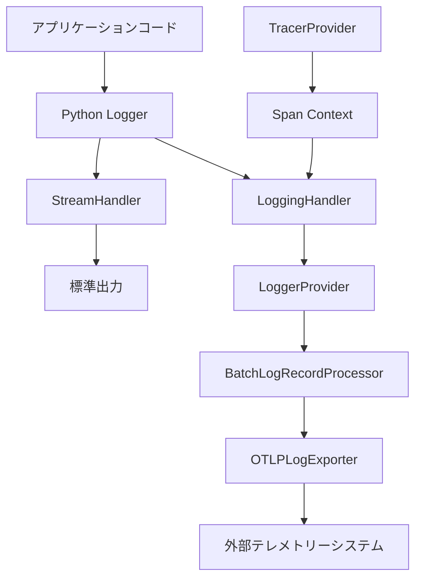

# OpenTelemetry Python logging 統合の詳細解説

## 概要

この資料は、OpenTelemetry Python SDK と標準ライブラリ logging の統合について、**Python内のインスタンス関係性とデータフロー**を中心に詳しく説明します。

Python標準ライブラリのloggingと OpenTelemetryの統合により、既存のPythonログコードを変更せずに、OpenTelemetryのテレメトリー機能を追加できます。

---

## 1. アーキテクチャ概要

### 1.1 コンポーネント構成

```
[アプリケーションコード]
        ↓ logger.info() 呼び出し
[Python logging フレームワーク]
        ↓ 並列処理で両方に送信
[StreamHandler]          [OpenTelemetry LoggingHandler]
        ↓                         ↓ ログレコードを変換
[標準出力]                [OpenTelemetry SDK]
                                 ↓ OTLP形式で送信
                          [外部テレメトリーシステム]
```

### 1.2 主要インスタンスの関係性

OpenTelemetry と Python logging の統合では、以下のPythonオブジェクトが重要な役割を果たします：

| インスタンス | 役割 | ライフサイクル |
|-------------|------|-------------|
| `OpenTelemetrySdk` | 全体の統括管理 | アプリケーション起動時に作成、終了時にシャットダウン |
| `LoggerProvider` | ログ処理の管理 | SDKの一部として作成、ログ機能を提供 |
| `LoggingHandler` | Python logging統合 | logging設定で作成、ログレコードを変換 |
| `BatchLogRecordProcessor` | バッチ処理 | プロバイダー内で作成、効率的な送信を担当 |
| `OTLPLogExporter` | 外部送信 | プロセッサー内で作成、実際の送信を実行 |
| `LoggingInstrumentor` | 自動計装 | アプリケーション起動時に初期化 |

---

## 2. 詳細なデータフロー解析

### 2.1 ログメッセージの処理フロー

#### ステップ1: ログメッセージの生成
```python
# アプリケーションコードでの通常のPython logging使用
logger.info("ユーザーログイン: name=%s, id=%s", user_name, user_id)
```

この呼び出しにより、Python標準ライブラリのloggingフレームワーク内で `LogRecord` オブジェクトが作成されます。

#### ステップ2: ハンドラーによる処理
```python
# 内部的に以下の処理が実行される
log_record = LogRecord(
    name="example_otel.logging_example",
    level=logging.INFO,
    pathname="src/example_otel/logging_example.py",
    lineno=225,
    msg="ユーザーログイン: name=%s, id=%s",
    args=("田中太郎", 12345),
    exc_info=None
)
```

このログレコードは、設定されたすべてのハンドラーに送信されます：

1. **StreamHandler** → 標準出力に表示
2. **OpenTelemetry LoggingHandler** → OpenTelemetryシステムに送信

#### ステップ3: OpenTelemetry変換処理

`LoggingHandler` が `LogRecord` を受信すると、内部で以下の変換処理が実行されます：

```python
# OpenTelemetry LoggingHandler内での変換処理（疑似コード）
def emit(self, record: LogRecord) -> None:
    # 1. LogRecordからOpenTelemetry LogRecordへの変換
    otel_log_record = self._translate_log_record(record)
    
    # 2. トレースコンテキストの取得
    trace_context = trace.get_current()
    if trace_context:
        otel_log_record.trace_id = trace_context.get_span_context().trace_id
        otel_log_record.span_id = trace_context.get_span_context().span_id
    
    # 3. リソース情報の付与
    otel_log_record.resource = self._logger_provider._resource
    
    # 4. LoggerProviderへの送信
    self._logger_provider.get_logger(__name__).emit(otel_log_record)
```

#### ステップ4: バッチ処理とエクスポート

OpenTelemetry SDK内では、以下の処理が実行されます：

```python
# BatchLogRecordProcessor での処理（疑似コード）
class BatchLogRecordProcessor:
    def on_emit(self, log_record: LogRecord) -> None:
        # 1. バッファに追加
        self._buffer.append(log_record)
        
        # 2. バッファが満杯になったら、またはタイマーで定期的に送信
        if len(self._buffer) >= self._max_export_batch_size:
            self._export_batch()
    
    def _export_batch(self) -> None:
        batch = self._buffer[:self._max_export_batch_size]
        self._buffer = self._buffer[self._max_export_batch_size:]
        
        # 3. OTLPExporterで外部システムに送信
        self._exporter.export(batch)
```

---

## 3. インスタンス間の詳細な相互作用

### 3.1 初期化シーケンス

OpenTelemetry Python logging統合の初期化は、以下の順序で実行されます：

```python
def initialize_opentelemetry():
    # 1. リソース情報の作成
    resource = Resource.create({
        "service.name": "otel-python-logging-example",
        "service.version": "1.0.0"
    })
    
    # 2. LoggerProviderの初期化
    logger_provider = logs.get_logger_provider()
    
    # 3. OTLPExporterの作成
    otlp_exporter = OTLPLogExporter(
        endpoint="http://localhost:4317"
    )
    
    # 4. BatchProcessorの作成と設定
    processor = BatchLogRecordProcessor(otlp_exporter)
    logger_provider.add_log_record_processor(processor)
    
    # 5. LoggingHandlerの作成
    handler = LoggingHandler(logger_provider=logger_provider)
    
    # 6. Python loggingへのハンドラー追加
    logging.getLogger().addHandler(handler)
    
    # 7. 自動計装の有効化
    LoggingInstrumentor().instrument()
```

### 3.2 実行時のオブジェクト関係性



---

## 4. トレースとログの関連付け

### 4.1 トレースコンテキストの自動伝播

OpenTelemetry Python では、トレースコンテキストが自動的にログに関連付けられます：

```python
# トレースコンテキスト内でのログ出力
with tracer.start_as_current_span("user_operation") as span:
    # span情報が自動的にログに付与される
    logger.info("処理開始")  # trace_id, span_idが自動付与
    
    # 処理実行...
    
    logger.info("処理完了")  # 同じtrace_id, span_idが付与
```

内部的には、以下の処理が実行されます：

```python
# LoggingHandler内での自動関連付け（疑似コード）
def _get_trace_context(self) -> Optional[TraceContext]:
    current_span = trace.get_current_span()
    if current_span and current_span.is_recording():
        span_context = current_span.get_span_context()
        return TraceContext(
            trace_id=span_context.trace_id,
            span_id=span_context.span_id,
            trace_flags=span_context.trace_flags
        )
    return None
```

### 4.2 構造化ログとの統合

extra パラメーターを使用した構造化ログも自動的に処理されます：

```python
# 構造化ログの例
logger.info(
    "ユーザー操作",
    extra={
        "user_id": 12345,
        "operation": "login",
        "success": True,
        "processing_time_ms": 150
    }
)
```

この情報は、OpenTelemetryの属性として以下のように変換されます：

```python
# OpenTelemetry LogRecord内での属性設定（疑似コード）
otel_log_record.attributes = {
    "user_id": 12345,
    "operation": "login",
    "success": True,
    "processing_time_ms": 150,
    # 自動的に追加される属性
    "code.function": "demonstrate_structured_logging",
    "code.filepath": "src/example_otel/logging_example.py",
    "code.lineno": 225
}
```

---

## 5. パフォーマンスと最適化

### 5.1 バッチ処理の効果

`BatchLogRecordProcessor` により、個々のログメッセージをリアルタイムで送信する代わりに、複数のログをまとめて効率的に送信します：

```python
# バッチ処理設定の例
processor = BatchLogRecordProcessor(
    exporter,
    max_queue_size=2048,        # 内部キューの最大サイズ
    max_export_batch_size=512,  # 一回の送信での最大バッチサイズ
    export_timeout=30000,       # エクスポートタイムアウト（ミリ秒）
    schedule_delay=5000         # バッチ処理の間隔（ミリ秒）
)
```

### 5.2 メモリ使用量の管理

OpenTelemetry Python では、以下の機能によりメモリ使用量を管理しています：

1. **環状バッファ**: 固定サイズのバッファによるメモリ制限
2. **タイムアウト処理**: 古いログレコードの自動破棄
3. **バックプレッシャー**: バッファが満杯時の新しいログの処理制御

---

## 6. エラーハンドリングと信頼性

### 6.1 送信失敗時の処理

外部システムへの送信が失敗した場合の処理：

```python
# OTLPExporter内でのエラーハンドリング（疑似コード）
def export(self, log_records: List[LogRecord]) -> ExportResult:
    try:
        # gRPC経由でOTLPデータを送信
        response = self._stub.Export(otlp_request)
        return ExportResult.SUCCESS
    except grpc.RpcError as e:
        # 接続エラーやタイムアウトの場合
        if e.code() in [grpc.StatusCode.UNAVAILABLE, grpc.StatusCode.DEADLINE_EXCEEDED]:
            # 再試行可能なエラー
            return ExportResult.FAILURE_RETRYABLE
        else:
            # 再試行不可能なエラー
            return ExportResult.FAILURE_NOT_RETRYABLE
    except Exception as e:
        # その他のエラー
        return ExportResult.FAILURE_NOT_RETRYABLE
```

### 6.2 パフォーマンス監視

OpenTelemetry自体のパフォーマンス監視機能：

```python
# 内部メトリクスの取得例
def get_processor_metrics(processor: BatchLogRecordProcessor):
    return {
        "queue_size": processor.queue_size,
        "dropped_records": processor.dropped_records,
        "exported_records": processor.exported_records,
        "export_failures": processor.export_failures
    }
```

---

## 7. 実装上の注意点

### 7.1 Python固有の考慮事項

1. **GIL (Global Interpreter Lock)**
   - OpenTelemetryの処理は可能な限り非同期で実行
   - バックグラウンドスレッドでのエクスポート処理

2. **循環インポートの回避**
   - OpenTelemetryライブラリ自体がログを使用する場合の無限ループ防止

3. **例外処理の統合**
   - `exc_info=True` パラメーターによるスタックトレースの自動取得

### 7.2 設定のベストプラクティス

```python
# 推奨設定例
def setup_logging():
    # 1. 基本的なlogger設定
    logging.basicConfig(level=logging.INFO)
    
    # 2. OpenTelemetryハンドラーの追加
    handler = LoggingHandler(level=logging.INFO)
    logging.getLogger().addHandler(handler)
    
    # 3. 特定のロガーの詳細レベル設定
    logging.getLogger("example_otel").setLevel(logging.DEBUG)
    
    # 4. 外部ライブラリのノイズ削減
    logging.getLogger("grpc").setLevel(logging.WARNING)
    logging.getLogger("opentelemetry").setLevel(logging.INFO)
```

---

## 8. デバッグとトラブルシューティング

### 8.1 ログの確認方法

OpenTelemetryが正常に動作しているかを確認する方法：

```python
# デバッグレベルでのログ出力確認
import os
os.environ["OTEL_LOG_LEVEL"] = "debug"

# 内部メトリクスの確認
from opentelemetry.sdk.logs import LoggerProvider
provider = logs.get_logger_provider()
print(f"アクティブなプロセッサー数: {len(provider._log_record_processors)}")
```

### 8.2 よくある問題と解決方法

1. **ログが送信されない**
   ```python
   # エンドポイントの確認
   print(os.environ.get("OTEL_EXPORTER_OTLP_LOGS_ENDPOINT"))
   
   # プロセッサーの状態確認
   processor.force_flush(timeout_millis=5000)
   ```

2. **パフォーマンスの問題**
   ```python
   # バッチサイズの調整
   processor = BatchLogRecordProcessor(
       exporter,
       max_export_batch_size=256,  # より小さなバッチサイズ
       schedule_delay=1000         # より頻繁な送信
   )
   ```

---

## 9. まとめ

OpenTelemetry Python logging統合は、以下の利点を提供します：

✅ **既存コードの互換性**: 既存のPython loggingコードをそのまま使用可能  
✅ **自動トレース関連付け**: スパンコンテキストが自動的にログに付与  
✅ **構造化ログサポート**: extra パラメーターが自動的に属性として変換  
✅ **高性能**: バッチ処理による効率的なデータ送信  
✅ **信頼性**: エラーハンドリングと再試行機能  

このアーキテクチャにより、Pythonアプリケーションの可観測性を大幅に向上させることができます。