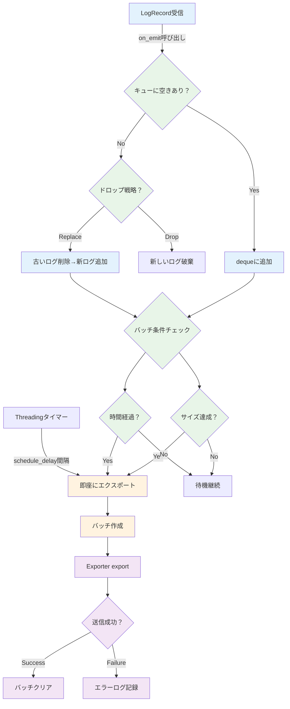
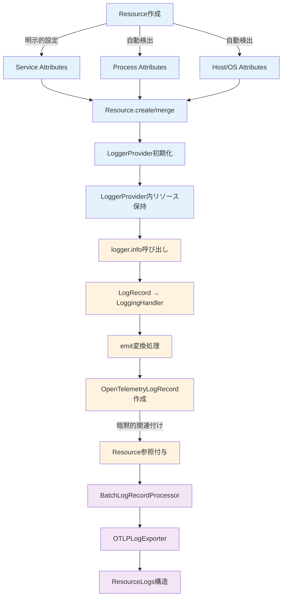
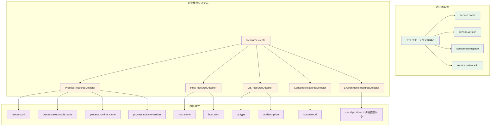
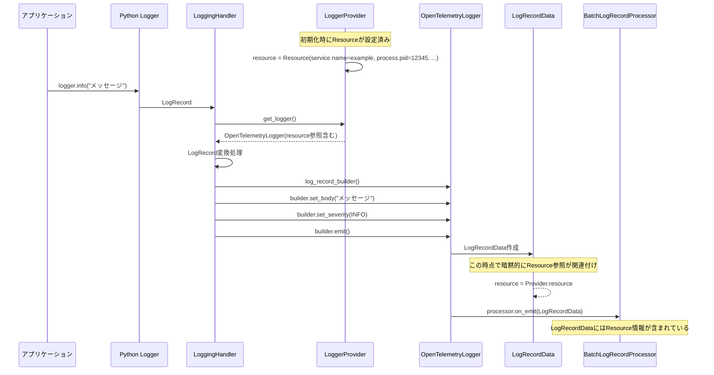
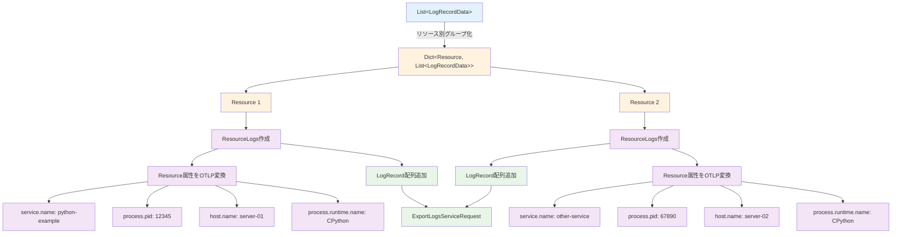
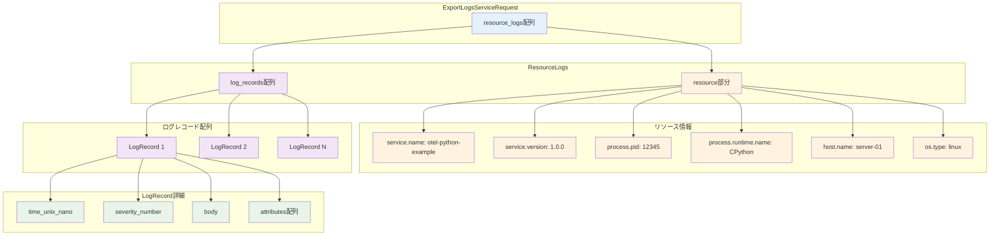
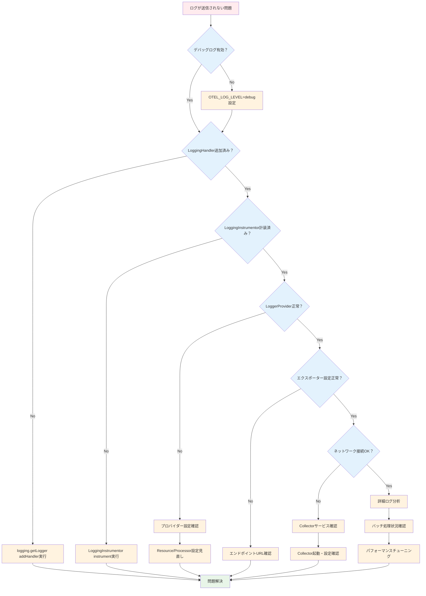

# OpenTelemetry Python logging 統合の詳細解説

## 概要

この資料は、OpenTelemetry Python SDK と標準ライブラリ logging の統合について、**Python内のインスタンス関係性とデータフロー**を中心に詳しく説明します。

Python標準ライブラリのloggingと OpenTelemetryの統合により、既存のPythonログコードを変更せずに、OpenTelemetryのテレメトリー機能を追加できます。

**⚠️ 重要**: OpenTelemetry Python のLogging機能は現在「Development」段階であり、将来的に互換性のない変更が行われる可能性があります。本番環境での使用前に最新のドキュメントを確認してください。

**システム要件**: Python 3.9以上（推奨: Python 3.11以上）

---

## 1. アーキテクチャ概要

### 1.1 コンポーネント構成


### 1.2 主要インスタンスの関係性


OpenTelemetry と Python logging の統合では、以下のPythonオブジェクトが重要な役割を果たします：

| インスタンス | 役割 | ライフサイクル |
|-------------|------|-------------|
| `OpenTelemetrySdk` | 全体の統括管理 | アプリケーション起動時に作成、終了時にシャットダウン |
| `LoggerProvider` | ログ処理の管理 | SDKの一部として作成、ログ機能を提供 |
| `LoggingHandler` | Python logging統合 | logging設定で作成、ログレコードを変換 |
| `BatchLogRecordProcessor` | バッチ処理 | プロバイダー内で作成、効率的な送信を担当 |
| `OTLPLogExporter` | 外部送信 | プロセッサー内で作成、実際の送信を実行 |
| `LoggingInstrumentor` | 自動計装 | アプリケーション起動時に初期化 |

---

## 2. 詳細なデータフロー解析

### 2.1 ログメッセージの処理フロー


#### ステップ1: ログメッセージの生成
```python
# アプリケーションコードでの通常のPython logging使用
logger.info("ユーザーログイン: name=%s, id=%s", user_name, user_id)
```

この呼び出しにより、Python標準ライブラリのloggingフレームワーク内で `LogRecord` オブジェクトが作成されます。

#### ステップ2: ハンドラーによる処理
```python
# 内部的に以下の処理が実行される
log_record = LogRecord(
    name="example_otel.logging_example",
    level=logging.INFO,
    pathname="src/example_otel/logging_example.py",
    lineno=225,
    msg="ユーザーログイン: name=%s, id=%s",
    args=("田中太郎", 12345),
    exc_info=None
)
```

このログレコードは、設定されたすべてのハンドラーに送信されます：

1. **StreamHandler** → 標準出力に表示
2. **OpenTelemetry LoggingHandler** → OpenTelemetryシステムに送信

#### ステップ3: OpenTelemetry変換処理

`LoggingHandler` が `LogRecord` を受信すると、内部で以下の変換処理が実行されます：

```python
# OpenTelemetry LoggingHandler内での変換処理（疑似コード）
def emit(self, record: LogRecord) -> None:
    # 1. LogRecordからOpenTelemetry LogRecordへの変換
    otel_log_record = self._translate_log_record(record)
    
    # 2. トレースコンテキストの取得
    trace_context = trace.get_current()
    if trace_context:
        otel_log_record.trace_id = trace_context.get_span_context().trace_id
        otel_log_record.span_id = trace_context.get_span_context().span_id
    
    # 3. リソース情報の付与
    otel_log_record.resource = self._logger_provider._resource
    
    # 4. LoggerProviderへの送信
    self._logger_provider.get_logger(__name__).emit(otel_log_record)
```

#### ステップ4: バッチ処理とエクスポート

OpenTelemetry SDK内では、以下の処理が実行されます：

```python
# BatchLogRecordProcessor での処理（疑似コード）
class BatchLogRecordProcessor:
    def on_emit(self, log_record: LogRecord) -> None:
        # 1. バッファに追加
        self._buffer.append(log_record)
        
        # 2. バッファが満杯になったら、またはタイマーで定期的に送信
        if len(self._buffer) >= self._max_export_batch_size:
            self._export_batch()
    
    def _export_batch(self) -> None:
        batch = self._buffer[:self._max_export_batch_size]
        self._buffer = self._buffer[self._max_export_batch_size:]
        
        # 3. OTLPExporterで外部システムに送信
        self._exporter.export(batch)
```

---

## 3. インスタンス間の詳細な相互作用

### 3.1 初期化シーケンス


OpenTelemetry Python logging統合の初期化は、以下の順序で実行されます：

```python
def initialize_opentelemetry():
    # 1. リソース情報の作成
    resource = Resource.create({
        "service.name": "otel-python-logging-example",
        "service.version": "1.0.0"
    })
    
    # 2. LoggerProviderの初期化
    logger_provider = logs.get_logger_provider()
    
    # 3. OTLPExporterの作成
    otlp_exporter = OTLPLogExporter(
        endpoint="http://localhost:4317"
    )
    
    # 4. BatchProcessorの作成と設定
    processor = BatchLogRecordProcessor(otlp_exporter)
    logger_provider.add_log_record_processor(processor)
    
    # 5. LoggingHandlerの作成
    handler = LoggingHandler(logger_provider=logger_provider)
    
    # 6. Python loggingへのハンドラー追加
    logging.getLogger().addHandler(handler)
    
    # 7. 自動計装の有効化
    LoggingInstrumentor().instrument()
```

### 3.2 実行時のオブジェクト関係性


---

## 4. トレースとログの関連付け

### 4.1 トレースコンテキストの自動伝播


OpenTelemetry Python では、トレースコンテキストが自動的にログに関連付けられます：

```python
# トレースコンテキスト内でのログ出力
with tracer.start_as_current_span("user_operation") as span:
    # span情報が自動的にログに付与される
    logger.info("処理開始")  # trace_id, span_idが自動付与
    
    # 処理実行...
    
    logger.info("処理完了")  # 同じtrace_id, span_idが付与
```

内部的には、以下の処理が実行されます：

```python
# LoggingHandler内での自動関連付け（疑似コード）
def _get_trace_context(self) -> Optional[TraceContext]:
    current_span = trace.get_current_span()
    if current_span and current_span.is_recording():
        span_context = current_span.get_span_context()
        return TraceContext(
            trace_id=span_context.trace_id,
            span_id=span_context.span_id,
            trace_flags=span_context.trace_flags
        )
    return None
```

### 4.2 構造化ログとの統合

extra パラメーターを使用した構造化ログも自動的に処理されます：

```python
# 構造化ログの例
logger.info(
    "ユーザー操作",
    extra={
        "user_id": 12345,
        "operation": "login",
        "success": True,
        "processing_time_ms": 150
    }
)
```

この情報は、OpenTelemetryの属性として以下のように変換されます：

```python
# OpenTelemetry LogRecord内での属性設定（疑似コード）
otel_log_record.attributes = {
    "user_id": 12345,
    "operation": "login",
    "success": True,
    "processing_time_ms": 150,
    # 自動的に追加される属性
    "code.function": "demonstrate_structured_logging",
    "code.filepath": "src/example_otel/logging_example.py",
    "code.lineno": 225
}
```

---

## 5. パフォーマンスと最適化

### 5.1 バッチ処理フロー



#### CPU使用量とメモリの分析


### 5.1 バッチ処理の効果

`BatchLogRecordProcessor` により、個々のログメッセージをリアルタイムで送信する代わりに、複数のログをまとめて効率的に送信します：

```python
# バッチ処理設定の例
processor = BatchLogRecordProcessor(
    exporter,
    max_queue_size=2048,        # 内部キューの最大サイズ
    max_export_batch_size=512,  # 一回の送信での最大バッチサイズ
    export_timeout=30000,       # エクスポートタイムアウト（ミリ秒）
    schedule_delay=5000         # バッチ処理の間隔（ミリ秒）
)
```

### 5.2 メモリ使用量の管理


OpenTelemetry Python では、以下の機能によりメモリ使用量を管理しています：

1. **環状バッファ**: 固定サイズのバッファによるメモリ制限
2. **タイムアウト処理**: 古いログレコードの自動破棄
3. **バックプレッシャー**: バッファが満杯時の新しいログの処理制御

---

## 6. エラーハンドリングと信頼性

### 6.1 エラーハンドリングフロー


#### Python固有のエラーハンドリング


### 6.1 送信失敗時の処理

外部システムへの送信が失敗した場合の処理：

```python
# OTLPExporter内でのエラーハンドリング（疑似コード）
def export(self, log_records: List[LogRecord]) -> ExportResult:
    try:
        # gRPC経由でOTLPデータを送信
        response = self._stub.Export(otlp_request)
        return ExportResult.SUCCESS
    except grpc.RpcError as e:
        # 接続エラーやタイムアウトの場合
        if e.code() in [grpc.StatusCode.UNAVAILABLE, grpc.StatusCode.DEADLINE_EXCEEDED]:
            # 再試行可能なエラー
            return ExportResult.FAILURE_RETRYABLE
        else:
            # 再試行不可能なエラー
            return ExportResult.FAILURE_NOT_RETRYABLE
    except Exception as e:
        # その他のエラー
        return ExportResult.FAILURE_NOT_RETRYABLE
```

### 6.2 パフォーマンス監視

OpenTelemetry自体のパフォーマンス監視機能：

```python
# 内部メトリクスの取得例
def get_processor_metrics(processor: BatchLogRecordProcessor):
    return {
        "queue_size": processor.queue_size,
        "dropped_records": processor.dropped_records,
        "exported_records": processor.exported_records,
        "export_failures": processor.export_failures
    }
```

---

## 7. 実装上の注意点

### 7.1 Python固有の考慮事項

1. **GIL (Global Interpreter Lock)**
   - OpenTelemetryの処理は可能な限り非同期で実行
   - バックグラウンドスレッドでのエクスポート処理

2. **循環インポートの回避**
   - OpenTelemetryライブラリ自体がログを使用する場合の無限ループ防止

3. **例外処理の統合**
   - `exc_info=True` パラメーターによるスタックトレースの自動取得

### 7.2 設定のベストプラクティス

```python
# 推奨設定例
def setup_logging():
    # 1. 基本的なlogger設定
    logging.basicConfig(level=logging.INFO)
    
    # 2. OpenTelemetryハンドラーの追加
    handler = LoggingHandler(level=logging.INFO)
    logging.getLogger().addHandler(handler)
    
    # 3. 特定のロガーの詳細レベル設定
    logging.getLogger("example_otel").setLevel(logging.DEBUG)
    
    # 4. 外部ライブラリのノイズ削減
    logging.getLogger("grpc").setLevel(logging.WARNING)
    logging.getLogger("opentelemetry").setLevel(logging.INFO)
```

### 7.3 重要な環境変数設定

```bash
# トレースコンテキストをログに自動注入するために必要
export OTEL_PYTHON_LOG_CORRELATION=true

# カスタムログフォーマットの指定（オプション）
export OTEL_PYTHON_LOG_FORMAT="%(asctime)s %(levelname)s [%(name)s] [trace_id=%(otelTraceID)s span_id=%(otelSpanID)s] - %(message)s"

# OpenTelemetryのデバッグレベル設定
export OTEL_LOG_LEVEL=info

# エクスポートエンドポイントの設定
export OTEL_EXPORTER_OTLP_LOGS_ENDPOINT=http://localhost:4317
```

**重要な注意事項**:
- `OTEL_PYTHON_LOG_CORRELATION=true`の設定なしでは、ログにトレースコンテキスト（trace_id、span_id）が自動注入されません
- LoggingInstrumentorを使用する場合は、`set_logging_format=True`パラメーターで代替可能です

---

## 7. リソースコンテキストの付与メカニズム

リソースコンテキストは、**どのサービスからテレメトリーデータが送信されたか**を識別する重要な情報です。OpenTelemetry Python では、この情報が以下のフローで自動的にログに付与されます。

### 7.1 リソース属性付与の全体フロー



### 7.2 リソース情報の設定場所

Python版では、以下の方法でリソース情報を設定します：

```python
# 1. Resource オブジェクトの作成（初期化時）
from opentelemetry.sdk.resources import Resource
from opentelemetry.semconv.resource import ResourceAttributes

resource = Resource.create({
    ResourceAttributes.SERVICE_NAME: "otel-python-logging-example",
    ResourceAttributes.SERVICE_VERSION: "1.0.0",
    ResourceAttributes.SERVICE_NAMESPACE: "example.com"
})

# 2. LoggerProvider へのリソース関連付け
from opentelemetry.sdk.logs import LoggerProvider

logger_provider = LoggerProvider(resource=resource)
```

**重要なポイント**: リソース情報は `LoggerProvider(resource=resource)` で設定され、そのプロバイダーから作成される**すべてのLogRecord**に自動的に関連付けられます。

### 7.3 自動付与されるリソース属性の詳細



OpenTelemetry Python SDK は、明示的に設定した属性に加えて、以下の情報を**自動的**に検出・付与します：

```python
# Resource.create() で自動検出される属性例
from opentelemetry.sdk.resources import Resource

# デフォルトリソースの取得
default_resource = Resource.get_empty()
detected_resource = Resource.create()  # 自動検出実行

# 実際に含まれる属性の例:
# - "process.pid": プロセスID
# - "process.executable.name": "python" 
# - "process.runtime.name": "CPython"
# - "process.runtime.version": "3.11.5"
# - "process.runtime.description": "CPython 3.11.5"
# - "os.type": "linux" / "windows" / "darwin"
# - "os.description": OS詳細情報
# - "host.name": ホスト名
# - "host.arch": "x86_64" / "arm64" 等

print(f"検出されたリソース属性: {detected_resource.attributes}")
```

### 7.4 リソースコンテキスト付与のタイミング



```python
# LoggingHandler内でのリソース関連付けフロー（疑似コード）

class LoggingHandler(Handler):
    def __init__(self, logger_provider: LoggerProvider):
        super().__init__()
        self._logger_provider = logger_provider
        # LoggerProviderからOpenTelemetryLoggerを取得
        self._otel_logger = logger_provider.get_logger(__name__)
    
    def emit(self, record: logging.LogRecord) -> None:
        # 1. Python標準ログからOpenTelemetryログレコードへの変換
        log_record_builder = self._otel_logger.log_record_builder()
        
        # 2. ログ固有の属性を設定
        log_record_builder.set_body(record.getMessage())
        log_record_builder.set_severity(self._map_severity(record.levelno))
        log_record_builder.set_timestamp(int(record.created * 1_000_000_000))
        
        # 3. ログレコードとして emit（この時点でリソース参照が暗黙的に関連付け）
        log_record_builder.emit()

# OpenTelemetryLogger内部処理（疑似コード）
class Logger:
    def __init__(self, resource: Resource, processors: List[LogRecordProcessor]):
        self._resource = resource  # LoggerProviderから受け継いだリソース
        self._processors = processors
    
    def emit(self, log_record_builder: LogRecordBuilder) -> None:
        # LogRecordBuilderからLogRecordDataを作成
        log_record = log_record_builder.build()
        
        # この時点で log_record は以下を持つ：
        # - ログ固有の属性（メッセージ、レベル、タイムスタンプ等）
        # - 暗黙的なリソース参照（service.name, process.pid等）
        log_record._resource = self._resource
        
        # プロセッサーチェーンに渡す
        for processor in self._processors:
            processor.on_emit(log_record)
```

### 7.5 エクスポート時のリソース情報処理



```python
# OTLPLogExporter でのリソース処理（疑似コード）
from opentelemetry.proto.logs.v1 import logs_pb2
from opentelemetry.proto.resource.v1 import resource_pb2
from collections import defaultdict

class OTLPLogExporter:
    def export(self, log_records: List[LogRecordData]) -> ExportResult:
        # 1. リソース別にログレコードをグループ化
        resource_logs_map = defaultdict(list)
        for log_record in log_records:
            resource_logs_map[log_record.resource].append(log_record)
        
        # 2. ExportLogsServiceRequestを構築
        export_request = logs_pb2.ExportLogsServiceRequest()
        
        for resource, logs in resource_logs_map.items():
            # ResourceLogsを作成
            resource_logs = logs_pb2.ResourceLogs()
            
            # リソース属性をProtobuf形式に変換
            pb_resource = resource_pb2.Resource()
            for key, value in resource.attributes.items():
                attribute = pb_resource.attributes.add()
                attribute.key = key
                attribute.value.CopyFrom(self._convert_to_any_value(value))
            
            resource_logs.resource.CopyFrom(pb_resource)
            
            # ログレコード配列を設定
            for log_record in logs:
                pb_log_record = logs_pb2.LogRecord()
                
                # ログ固有の属性を設定
                pb_log_record.time_unix_nano = log_record.timestamp
                pb_log_record.severity_number = log_record.severity.value
                pb_log_record.severity_text = log_record.severity.name
                pb_log_record.body.string_value = str(log_record.body)
                
                # ログレコード固有の属性を追加
                for attr_key, attr_value in log_record.attributes.items():
                    attribute = pb_log_record.attributes.add()
                    attribute.key = attr_key
                    attribute.value.CopyFrom(self._convert_to_any_value(attr_value))
                
                resource_logs.log_records.append(pb_log_record)
            
            export_request.resource_logs.append(resource_logs)
        
        # 3. gRPC経由で送信
        return self._send_to_collector(export_request)
```

### 7.6 実際のOTLP出力構造



Python版でのOTLP出力例：

```json
{
  "resource_logs": [
    {
      "resource": {
        "attributes": [
          {"key": "service.name", "value": {"string_value": "otel-python-logging-example"}},
          {"key": "service.version", "value": {"string_value": "1.0.0"}},
          {"key": "process.pid", "value": {"int_value": 12345}},
          {"key": "process.runtime.name", "value": {"string_value": "CPython"}},
          {"key": "process.runtime.version", "value": {"string_value": "3.11.5"}},
          {"key": "host.name", "value": {"string_value": "server-01"}},
          {"key": "os.type", "value": {"string_value": "linux"}}
        ]
      },
      "log_records": [
        {
          "time_unix_nano": "1640995200000000000",
          "severity_number": 9,
          "severity_text": "INFO",
          "body": {"string_value": "ユーザーログイン: name=田中太郎, id=12345"},
          "attributes": [
            {"key": "code.function", "value": {"string_value": "demonstrate_structured_logging"}},
            {"key": "code.filepath", "value": {"string_value": "src/example_otel/logging_example.py"}},
            {"key": "code.lineno", "value": {"int_value": 225}},
            {"key": "user_id", "value": {"int_value": 12345}},
            {"key": "operation", "value": {"string_value": "login"}},
            {"key": "trace_id", "value": {"string_value": "abc123..."}},
            {"key": "span_id", "value": {"string_value": "def456..."}}
          ]
        }
      ]
    }
  ]
}
```

### 7.7 Python固有のリソース検出機能

```python
# Python固有のリソース検出例
from opentelemetry.sdk.resources import Resource
from opentelemetry.sdk.resources.processor import ResourceProcessor

# カスタムリソースディテクターの例
class CustomResourceDetector:
    def detect(self) -> Resource:
        import sys
        import platform
        
        return Resource.create({
            "python.implementation": platform.python_implementation(),
            "python.version": platform.python_version(),
            "python.executable": sys.executable,
            "python.path": ",".join(sys.path[:3]),  # 最初の3つのパスのみ
        })

# 使用例
custom_detector = CustomResourceDetector()
detected_resource = custom_detector.detect()

# 既存のリソースとマージ
final_resource = Resource.get_empty().merge(detected_resource)
```

**結論**: Python版では、リソース情報とログ属性が**分離されて管理**され、エクスポート時にOTLP形式で適切に結合されます。これにより、サービス識別情報とログ固有の情報が明確に区別されながらも、関連付けられた形でテレメトリーシステムに送信されます。

---

## 8. デバッグとトラブルシューティング

### 8.1 問題診断フローチャート



#### Python固有のデバッグポイント


### 8.1 ログの確認方法

OpenTelemetryが正常に動作しているかを確認する方法：

```python
# デバッグレベルでのログ出力確認
import os
os.environ["OTEL_LOG_LEVEL"] = "debug"

# 内部メトリクスの確認
from opentelemetry.sdk.logs import LoggerProvider
provider = logs.get_logger_provider()
print(f"アクティブなプロセッサー数: {len(provider._log_record_processors)}")
```

### 8.2 よくある問題と解決方法

1. **ログが送信されない**
   ```python
   # エンドポイントの確認
   print(os.environ.get("OTEL_EXPORTER_OTLP_LOGS_ENDPOINT"))
   
   # プロセッサーの状態確認
   processor.force_flush(timeout_millis=5000)
   ```

2. **パフォーマンスの問題**
   ```python
   # バッチサイズの調整
   processor = BatchLogRecordProcessor(
       exporter,
       max_export_batch_size=256,  # より小さなバッチサイズ
       schedule_delay=1000         # より頻繁な送信
   )
   ```

---

## 9. まとめ

OpenTelemetry Python logging統合は、以下の利点を提供します：

✅ **既存コードの互換性**: 既存のPython loggingコードをそのまま使用可能  
✅ **自動トレース関連付け**: スパンコンテキストが自動的にログに付与  
✅ **構造化ログサポート**: extra パラメーターが自動的に属性として変換  
✅ **高性能**: バッチ処理による効率的なデータ送信  
✅ **信頼性**: エラーハンドリングと再試行機能  

このアーキテクチャにより、Pythonアプリケーションの可観測性を大幅に向上させることができます。